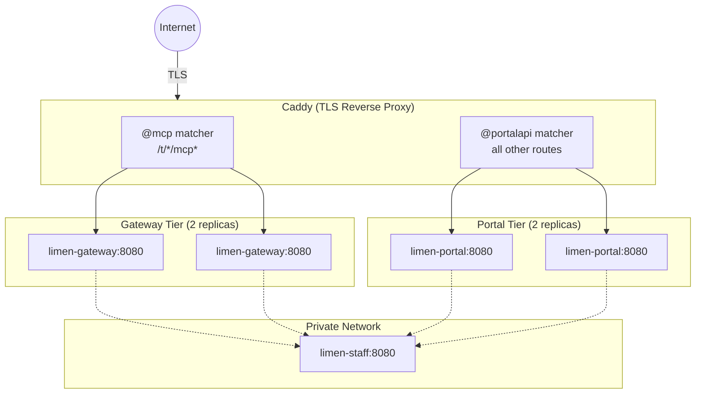
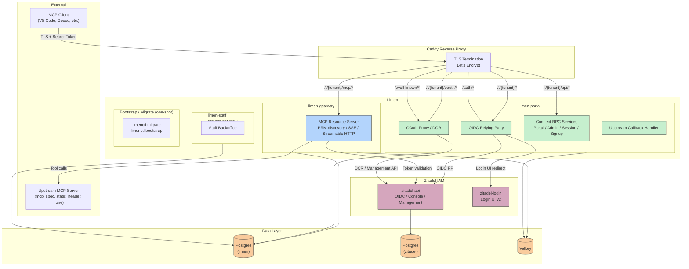
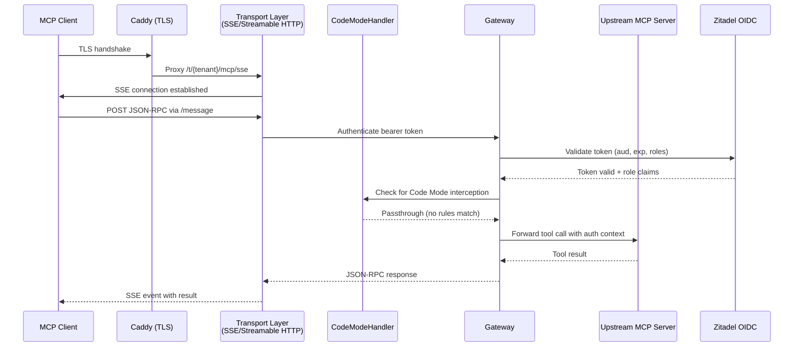
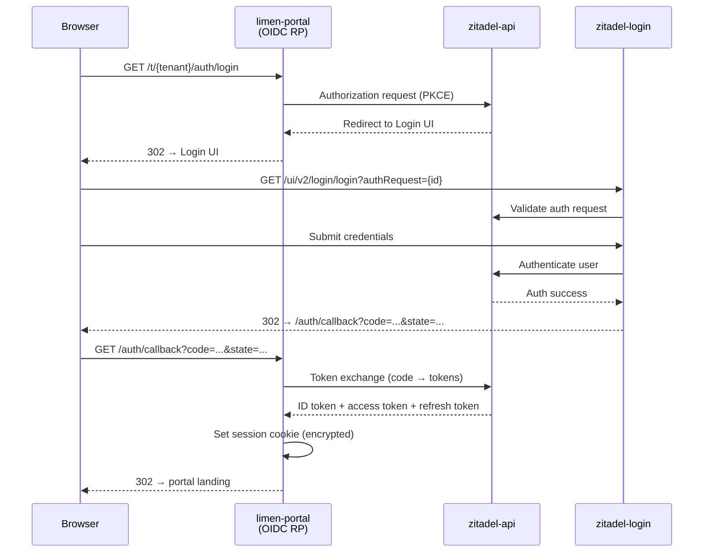
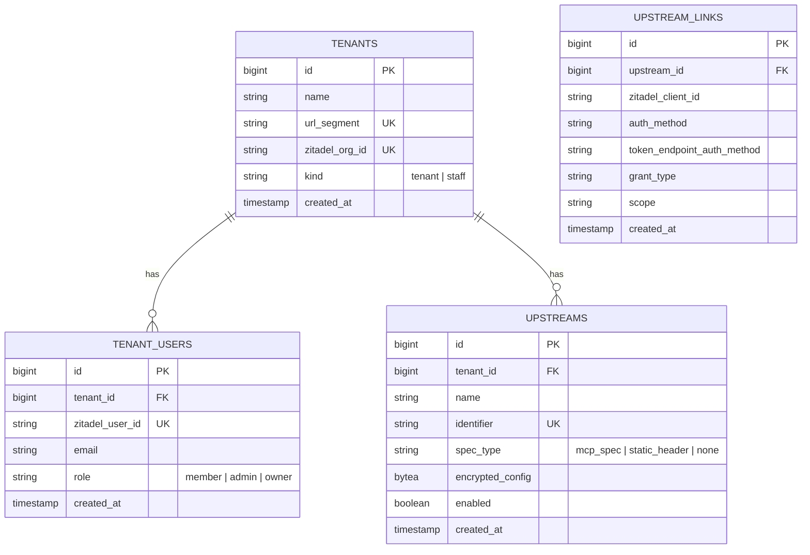

# Limen Architecture

## System Overview

Limen is an MCP (Model Context Protocol) gateway that aggregates multiple upstream MCP servers behind a single SSE endpoint. Its defining feature is **Code Mode** -- a Goja JavaScript sandbox that collapses all upstream tool definitions into just two meta-tools (`codemode_search` and `codemode_execute`), achieving 94-99% context window reduction compared to traditional tool proxying.

Rather than forwarding every tool schema to the LLM client, Limen inverts the model: the LLM writes JavaScript to discover and invoke only the tools it needs, at the moment it needs them.

### Production Deployment

**Note**: `limen-staff` lives on a private Docker network with `internal: true`, meaning no public ingress routes to it. The dashed lines indicate internal-only access from gateway and portal replicas.

## Component Diagram

## Request Lifecycle

1. **Client connects** to Limen's `/mcp` SSE endpoint via the transport layer.
2. **Tool initialization**: `MCPServer` registers two tools (`codemode_search`, `codemode_execute`) with the `mcp-go` server. The client sees only these two tools.
3. **Discovery phase**: The client calls `codemode_search` with JavaScript code. `CodeModeHandler.Search()` creates a Goja VM, injects all tool definitions as JSON, and exposes `codemode.tools()`. The JS runs and returns a filtered list of relevant tools.
4. **Execution phase**: The client calls `codemode_execute` with JavaScript that invokes tools. `CodeModeHandler.Execute()` creates a fresh Goja VM where each tool is injected as a proxy function on the `codemode` object (e.g., `codemode.jira_get_ticket({id: "PROJ-123"})`).
5. **Tool proxy**: When JS calls a tool proxy, the handler resolves the tool's upstream, calls `Gateway.CallTool()`, which delegates to the appropriate `MCPUpstreamClient`.
6. **Upstream call**: `MCPUpstreamClient.CallTool()` sends a JSON-RPC `tools/call` request to the upstream server via Streamable HTTP using `mcp-go/client`.
7. **Response propagation**: The upstream response flows back through the gateway → handler → transport → SSE → client, serialized as JSON text content.

## Auth Flow

## Package Breakdown

### Binaries

Limen ships as **five binaries today** (a sixth, `limen-observer`, lands
in [Phase 16](phases/phase-16-observability-and-active-users.md)) built
from a single Go module. The split is at the entry-point + Docker-image
boundary only; everything in `internal/boot` and `internal/*` is shared.

| Binary           | Entry            | Mounts                                                                                 | Boot profile                                     |
| ---------------- | ---------------- | -------------------------------------------------------------------------------------- | ------------------------------------------------ |
| `limen`          | `cmd/limen`      | Everything (MCP RS + portal + OIDC RP + OAuth proxy + upstream callback)               | `boot.AllProfiles`                               |
| `limen-gateway`  | `cmd/gateway`    | `/healthz`, `/readyz`, `/t/{tenant}/mcp/*` — the MCP Resource Server hot path only     | `NeedStore \| NeedCipher \| NeedUpstream`        |
| `limen-portal`   | `cmd/portal`     | Portal SPA, OIDC RP under `/t/{tenant}/auth/*`, OAuth proxy under `/t/{tenant}/oauth/*`, upstream OAuth callback | `NeedStore \| NeedCipher \| NeedSigner`          |
| `limen-staff`    | `cmd/staff`      | `/healthz`, `/readyz` today; backoffice routes land in Phase 12                        | `NeedStore`                                      |
| `limenctl`       | `cmd/limenctl`   | Admin CLI: `migrate`, `create-tenant`, `create-upstream` (no HTTP)                     | n/a                                              |
| `limen-observer` *(Phase 16)* | `cmd/observer` | No HTTP surface — drains the `tool_calls` and `audit` Valkey Streams and owns every Postgres write for observability + audit | `NeedStore \| NeedCipher \| NeedValkey` |

Production runs `limen-gateway`, `limen-portal`, and `limen-staff` as
separate services with `limenctl migrate` as a one-shot init container. The
all-in-one `limen` is for dev and small self-hosted deployments (and, once
Phase 16 lands, embeds the observer as a goroutine rather than a separate
process). See
[docs/phases/phase-09a-binary-split.md](phases/phase-09a-binary-split.md).

**Load-bearing constraint**: `cmd/gateway`'s transitive import graph must
**not** include `internal/oauthproxy` or `internal/zitadel`. The hot path
holds neither the Zitadel management credential nor the portal-session
cipher key, so a compromise of the MCP RS process cannot mint tokens or
read portal cookies. The constraint is enforced at test time by
`cmd/gateway/import_graph_test.go` (`go list -deps`).

### `internal/boot` -- Shared boot floor

`boot.BootRuntime(configPath, profile)` is the single entry point every
binary uses to construct its runtime dependencies. It loads config, builds
the logger, opens the database (when `NeedStore` is set), constructs the
AES-SIV cipher (`NeedCipher`), the portal-session signer (`NeedSigner`),
and the upstream registry + service (`NeedUpstream`) — and returns a
`*Runtime` plus a LIFO cleanup function. When `NeedStore` is set it also
calls `storage.CheckSchemaVersion`, which refuses to start on schema-version
skew with a "run `limenctl migrate`" message.

Per-suite mount helpers live in sibling subpackages so the binaries that
don't need a given suite never pull it transitively:

| Subpackage                   | Purpose                                                                               |
| ---------------------------- | ------------------------------------------------------------------------------------- |
| `internal/boot/mcpmount`     | Mounts the MCP RS routes + PRM document under `/t/{tenant}/mcp/*`                      |
| `internal/boot/portalmount`  | Mounts the portal SPA under `/`                                                        |
| `internal/boot/oauthproxymount` | Mounts inbound DCR + AS-metadata proxy under `/t/{tenant}/oauth/*`                  |
| `internal/boot/upstreammount`   | Mounts the upstream OAuth callback                                                  |
| `internal/boot/oidcboot`     | Builds the OIDC RP (portal login/callback/logout)                                      |
| `internal/boot/zitadelboot`  | Builds the Zitadel admin client used by the portal + staff                             |
| `internal/boot/serveall`     | Composes all suites for the all-in-one `cmd/limen`                                     |
| `internal/boot/servegateway` | Composes only `mcpmount` for `cmd/gateway`                                             |
| `internal/boot/serveportal`  | Composes `portalmount` + `oauthproxymount` + `upstreammount` + `oidcboot` + `zitadelboot` for `cmd/portal` |
| `internal/boot/servestaff`   | Scaffolds the staff binary for `cmd/staff`                                             |

Service `main.go` files are 1–2 calls each: load config path → call
`serve{all,gateway,portal,staff}.Run(configPath)`.

### `internal/config` -- Configuration

Defines typed configuration structs and YAML loading:

| Type             | Fields                                                                                       |
| ---------------- | -------------------------------------------------------------------------------------------- |
| `Config`         | `Server`, `CodeMode`, `Database`, `Security`, `OIDC`, `Zitadel`, `OAuthProxy`                |
| `ServerConfig`   | `Host` (string), `Port` (int), `BaseURL` (string)                                            |
| `CodeModeConfig` | `ExecutionTimeout` (time.Duration), `MaxMemoryMB` (int)                                      |
| `ZitadelConfig`  | `Domain`, `AuthMode`, `PAT`, `JWTKeyPath`, `ProjectID`, `MCPResourceAudience`, `HTTPTimeout` |

The `Load()` function reads a YAML file, applies defaults (port: 8080, host: 0.0.0.0, timeout: 30s, memory: 64 MB), and returns a validated `*Config`.

### `internal/gateway` -- Core Gateway

Three files form the core:

**`gateway.go`** -- The `Gateway` orchestrates upstream connections and tool routing.

- **`UpstreamClient` interface**: Contracts for upstream clients (`ListTools`, `CallTool`, `Close`, `Name`).
- **`ToolEntry`**: Represents a discovered tool with `Name`, `Description`, `InputSchema`, and its originating `Upstream`.
- **`Gateway`**: Maintains a `sync.Map` tool registry and a `map[string]UpstreamClient` for routing. Thread-safe via `sync.RWMutex`. Methods: `AddUpstream`, `RemoveUpstream`, `AllTools`, `FindTool`, `CallTool`, `UpstreamNames`, `Close`.

**`codemode.go`** -- The `CodeModeHandler` manages Goia JavaScript sandbox execution.

- **`ToolDefinition`**: Same shape as `ToolEntry` minus the `Upstream` field; used for JS serialization.
- **`Search()`**: Creates a Goja VM, marshals all tool definitions to JSON, injects `codemode.tools()`. Runs the provided JS code.
- **`Execute()`**: Creates a Goja VM, injects each tool as a native JS function on `codemode.<toolName>`, plus `codemode.call(name, args)` for dynamic dispatch. Runs the provided JS code.
- **`runCode()`**: Compiles and executes JS in a goroutine with timeout enforcement via `select` on `time.After` and `ctx.Done()`. Recovers panics and converts them to Go errors.

**`upstream.go`** -- `MCPUpstreamClient` implements the `UpstreamClient` interface.

- Connects to upstream servers via `mcp-go/client`'s `NewStreamableHttpClient` (Streamable HTTP transport).
- Sends MCP `initialize` handshake on `Connect()`.
- `ListTools()` fetches the upstream tool catalog.
- `CallTool()` proxies tool invocations with per-request timeout contexts.
- Applies custom headers (e.g., Authorization) and configurable timeouts.

### `internal/transport` -- HTTP/SSE Server

Exposes the MCP endpoint to LLM clients under `/t/{tenant}/mcp/*`:

- **`MCPServer`**: Wraps `mcp-go/server.MCPServer` and a single `SSEServer` configured with `WithDynamicBasePath` so one server instance correctly advertises per-tenant message endpoints (`/t/{tenant}/mcp/message`) depending on the resolved request tenant. Exposes `SSEHandler()` and `MessageHandler()` for chi mounting.
- **`MountMCPRS(r, MCPRSDeps{...})`**: Wires the PRM document, `RequireMCPAuth`, and the SSE/Message handlers under `/t/{tenant}/mcp` behind `tenancy.RequireTenant` (see `internal/transport/mcprs.go`).
- **`registerCodeModeTools()`**: Defines `codemode_search` and `codemode_execute` with rich descriptions and examples, then registers them with the core mcp-go server via `AddTool()`.

### `internal/auth` -- Portal RP + MCP Resource Server

Two roles share this package:

- **Portal RP** (`oidc.go`, `state.go`): the Zitadel-backed login/callback/logout flow for the management SPA.
- **MCP Resource Server** (`middleware.go`): `MCPAuth` validates inbound bearer access tokens in-process. Pipeline: bearer extract → `op.VerifyAccessToken` (iss / sig / exp / RS256-only) → audience check → `urn:zitadel:iam:user:resourceowner:id` claim must match `tenant.zitadel_org_id` → local user lookup. On any failure the handler emits an RFC 9728 `WWW-Authenticate: Bearer realm="mcp", resource_metadata="…"` challenge pointing at the per-tenant PRM document.

### `internal/mcprs` -- Protected Resource Metadata

Tiny package serving the RFC 9728 PRM document at
`/t/{tenant}/mcp/.well-known/oauth-protected-resource` and building the
`WWW-Authenticate` challenge consumed by `MCPAuth`. Public — no bearer
required, per RFC 9728 §3.

### `internal/oauthproxy` -- DCR + AS-metadata proxy

Inbound DCR (RFC 7591 / 7592) under `/t/{tenant}/oauth/register*`, plus the
`/.well-known/oauth-authorization-server` metadata redirector and the
`/authorize` redirector that injects Zitadel's
`urn:zitadel:iam:user:resourceowner` vendor scope (so the issued access
token carries `urn:zitadel:iam:user:resourceowner:id`, which `MCPAuth`
binds to the tenant org). DCR-created OIDC applications are placed in a
per-`client_name` Zitadel project, JIT-created under the tenant's
organization — see [phase 7b](phases/phase-07b-dcr-per-client-project.md).
Limen's shared `zitadel.project_id` project is reserved for the Portal SPA
app and the MCP Resource Server app.

### `internal/upstream` -- Outbound upstream linking

Upstream connections are driven by a **strategy registry**. Each upstream row carries a `strategy_type`, and the `Strategy` interface (`Provision`, `StartLink`, `FinishLink`, `Headers`, `Maintain`, `RequiresLink`) picks the right behavior at runtime. v1 ships three strategies:

- **`mcp_spec`** (`internal/upstream/mcpspec/`) — for MCP-spec-compliant OAuth resources. Limen acts as the OAuth 2.1 client, drives PKCE+code per user, persists tokens encrypted in `UpstreamLink`, and refreshes them in a background loop. The package is split into focused files: `strategy.go` (registration), `discovery.go` (PRM + AS metadata fetching, with RFC 9728 canonical and legacy well-known paths plus a `WWW-Authenticate` hint fallback), `config.go` (static-client `Config` codec), `provision.go` (DCR or static-client provisioning), `link.go` (authorize URL + token exchange), `refresh.go` (`Headers`, single-flighted refresh, `Maintain`).
  - **DCR mode**: when the upstream's authorization server advertises `registration_endpoint`, Limen dynamic-client-registers itself once per `(tenant, upstream)` via RFC 7591.
  - **Static OAuth client mode**: when the AS does not support DCR (GitHub's `login/oauth` being the canonical example), the operator provisions a client out-of-band on the upstream and passes the credentials to `limen create-upstream --client-id ... --client-secret ... [--issuer ...] [--authorization-endpoint ...] [--token-endpoint ...] [--scope ...]`. The CLI encrypts the bundle into `UpstreamStrategyConfig.ConfigJSON` (AAD `tenant|""|"upstream.mcpspec.strategy_config"`). At provision time the strategy reads it instead of running DCR; at discovery time any configured issuer / endpoints are overlaid on top of whatever AS metadata could be fetched (or synthesized entirely when the AS publishes none).
- **`static_header`** (`internal/upstream/statichdr/`) — for upstreams that authenticate via a fixed HTTP header. Two sub-modes: `tenant` (one shared secret on `UpstreamStrategyConfig`, visible to every user in the tenant) and `user` (each user pastes their own key, stored on `UpstreamLink.ExtraJSON`).
- **`none`** — no auth, for self-hosted upstreams on trusted networks; `Provision` refuses upstreams that advertise PRM (a safety net against operators picking the wrong strategy).

Phase 8 wires a per-request `http.RoundTripper` that calls `Strategy.Headers` to inject auth on outbound MCP calls, and reactively re-runs refresh on 401 through the same single-flight that `Headers` uses.

## Data Model

## Key Types

| Type                | Package     | Role                                                             |
| ------------------- | ----------- | ---------------------------------------------------------------- |
| `Gateway`           | `gateway`   | Central orchestrator; manages upstream clients and tool registry |
| `CodeModeHandler`   | `gateway`   | Goja JS sandbox; handles `search` and `execute` operations       |
| `MCPUpstreamClient` | `gateway`   | MCP protocol client for a single upstream server                 |
| `ToolEntry`         | `gateway`   | Tool metadata with upstream provenance                           |
| `ToolDefinition`    | `gateway`   | Tool metadata for JS serialization (no upstream field)           |
| `MCPServer`         | `transport` | HTTP/SSE server exposing the MCP endpoint                        |
| `UpstreamClient`    | `gateway`   | Interface that all upstream clients must implement               |
| `Config`            | `config`    | Top-level configuration loaded from YAML                         |

## Dependencies

| Module                        | Purpose                                           |
| ----------------------------- | ------------------------------------------------- |
| `github.com/mark3labs/mcp-go` | MCP protocol implementation (server + client)     |
| `github.com/dop251/goja`      | JavaScript engine (pure Go) for Code Mode sandbox |
| `github.com/go-chi/chi/v5`    | HTTP router for the SSE server                    |
| `go.uber.org/zap`             | Structured logging                                |
| `gopkg.in/yaml.v3`            | YAML config parsing                               |
