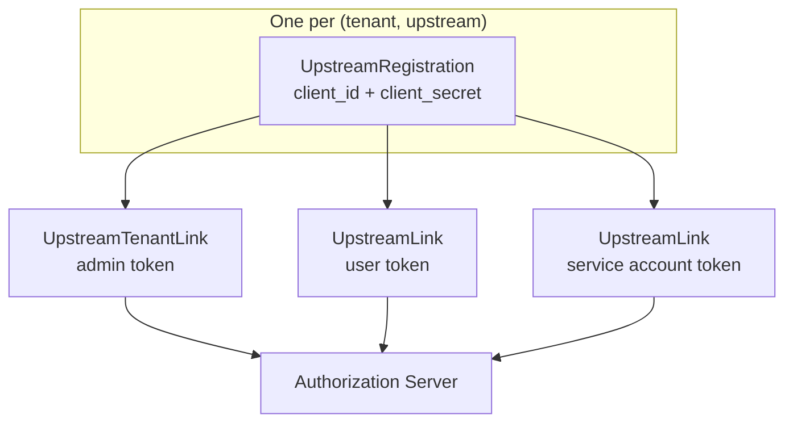

# Upstreams

Upstream servers are the MCP-compatible services that Limen aggregates behind a single endpoint. This guide covers upstream configuration, authentication strategies, connection behavior, and troubleshooting.

## Definition

An upstream is any MCP-compatible server that supports the **Streamable HTTP** transport. Limen connects to each provisioned upstream per-tenant, initializes the MCP session, and fetches the full tool list. These tools then become available to clients through Code Mode or direct proxying.

## Configuration

Upstreams are **not** configured in YAML. They are stored per-tenant in the database and managed via:

- `limen create-upstream` CLI command
- The portal UI (Upstreams section)

There is no global upstream list — every upstream is owned by a tenant and carries a **strategy** that drives credential handling.

### Database Fields

| Field            | Required | Description                                                                                                       |
| ---------------- | -------- | ----------------------------------------------------------------------------------------------------------------- |
| `name`           | Yes      | Unique identifier within the tenant. Used as a prefix for tool names (e.g., `github_search_issues`).              |
| `mcp_server_url` | Yes      | Full URL of the upstream MCP endpoint. Must use Streamable HTTP transport.                                        |
| `strategy_type`  | Yes      | One of `none`, `static_header`, or `mcp_spec`. See [Authentication Strategies](#authentication-strategies) below. |

## Authentication Strategies

Each upstream declares a strategy that controls how Limen authenticates outbound requests.

### `none` — No Authentication

For self-hosted or trusted-network servers that require no credentials.

- All users in the tenant get access automatically (`RequiresLink = false`).
- During provisioning, Limen probes `<url>/.well-known/oauth-protected-resource` and **rejects** the upstream if the server advertises a PRM document — that means it wants a Bearer token and the wrong strategy was chosen.
- No headers are attached to outbound requests.

**Use when:** internal MCP servers on a private network, local dev servers.

---

### `static_header` — Static HTTP Header

Attaches a fixed HTTP header to every outbound request. The admin **always**
supplies a shared secret at upstream creation; that secret powers "Test
Connection", the catalog indexer, and serves as the working default for every
user. The admin can optionally allow individual users to override the shared
secret with their own value — see `allow_user_override` below.

| Config knob           | Required | Effect                                                                                                    |
| --------------------- | -------- | --------------------------------------------------------------------------------------------------------- |
| `header_name`         | yes      | HTTP header field name (e.g. `Authorization`, `X-Api-Key`)                                                |
| `header_template`     | yes      | Header value with `{value}` placeholder, e.g. `Bearer {value}`                                            |
| `shared_secret`       | yes      | Always-on credential. Substituted into `{value}` by default.                                              |
| `allow_user_override` | no       | When `true`, users may submit their own key in the portal; it shadows `shared_secret` for that user only. |

The entire config — including `shared_secret` — is stored as an encrypted
JSON blob in `upstream_strategy_configs.config_json` (AES-SIV with AAD
`tenant|∅|"upstream.strategy_config"`); the plaintext never touches disk.
Per-user override keys live encrypted on `upstream_links.extra_json` (AAD
`tenant|user|"upstream.extra"`).

**Shared-only example** (single org API key, no overrides):

```
header_name:         Authorization
header_template:     Bearer {value}
shared_secret:       <org-api-key>
allow_user_override: false
```

**Shared + opt-in user override** (e.g. GitHub PATs with an org fallback):

```
header_name:         Authorization
header_template:     Bearer {value}
shared_secret:       <org-fallback-token>
allow_user_override: true
```

With `allow_user_override = true`, each user can navigate to the portal's
API-key entry page for that upstream and paste their own token. Until they
do, their requests go out under `shared_secret`. If their override key
later starts failing (401), the gateway transparently falls back to
`shared_secret` while flagging the link as `needs_relink` so the portal
can nudge them to rotate — tools never break for the user mid-session.

`RequiresLink = true` in both cases, but only because the per-user link row
doubles as an opt-out toggle (`Enabled = false` hides the tools from that
user). A missing link is fine — the gateway falls back to the shared secret
cleanly.

Sub-mode strings surfaced via `UpstreamSummary.strategy_sub_mode`:

| Value      | Meaning                                                         |
| ---------- | --------------------------------------------------------------- |
| `shared`   | `allow_user_override = false`; portal shows enable/disable      |
| `override` | `allow_user_override = true`; portal offers submit/rotate/clear |

**Use when:** SaaS APIs with a shared org token (set `allow_user_override =
false`) or APIs where each user _may_ prefer their own credentials while a
shared fallback exists (set `allow_user_override = true`).

---

### `mcp_spec` — MCP-Spec OAuth

For upstreams that implement the MCP OAuth specification. Limen acts as the OAuth client and drives a **code + PKCE (S256)** flow per user. Two client-provisioning sub-modes:

| Sub-mode                | When used                                              | How                                                                                    |
| ----------------------- | ------------------------------------------------------ | -------------------------------------------------------------------------------------- |
| **DCR** (default)       | The upstream's AS advertises a `registration_endpoint` | Limen auto-registers itself once per `(tenant, upstream)` via RFC 7591                 |
| **Static OAuth client** | No `registration_endpoint` (e.g. GitHub)               | Operator provisions a client out-of-band and supplies credentials at upstream creation |

`RequiresLink = true` — each user must complete the OAuth flow in the portal before tools are available.

#### PRM Discovery

Limen discovers the upstream's authorization server in this order:

1. RFC 9728 §3.1 canonical: `<origin>/.well-known/oauth-protected-resource<path>`
2. Legacy path: `<origin><path>/.well-known/oauth-protected-resource`
3. `WWW-Authenticate` header hint: unauthenticated GET to the MCP URL; if the server returns `401 Bearer realm="...", resource_metadata="<URL>"`, fetch that URL.
4. Synthesized PRM from a static `issuer` in the upstream's strategy config — covers servers like `api.githubcopilot.com/mcp/` that don't expose well-known paths.

#### Static OAuth client config fields

| Field                    | Description                                                                          |
| ------------------------ | ------------------------------------------------------------------------------------ |
| `client_id`              | OAuth client ID provisioned out-of-band on the AS. Presence of this field skips DCR. |
| `client_secret`          | Client secret (empty for public clients).                                            |
| `issuer`                 | AS issuer URL. Used when AS metadata discovery returns nothing.                      |
| `authorization_endpoint` | Override when the AS metadata document omits it.                                     |
| `token_endpoint`         | Override when the AS metadata document omits it.                                     |
| `scopes`                 | Additional scopes appended to the authorization request.                             |

Network-discovered values always take precedence; the static config is a fallback, never an override.

#### Token lifecycle

- `Headers()` returns `Authorization: Bearer <access_token>` and proactively refreshes tokens expiring within `upstream_refresh.proactive_window` (default 60 s).
- The background refresher (`upstream_refresh.refresh_window`, default 5 m) proactively rotates tokens approaching expiry.
- On `invalid_grant` or a 401 that survives a forced refresh, the link is flagged as `needs_relink` and the user must re-authorize in the portal.

#### Registration Lifecycle

There is exactly one `UpstreamRegistration` record per `(tenant, upstream)`. It stores the `client_id` and `client_secret` issued by the authorization server. **All three link types (tenant, user, service account) share the same registration row.** Individual tokens live in separate tables: `UpstreamTenantLink` for admin tokens, `UpstreamLink` for user and service account tokens.



**Registration creation.** Created on the first `Provision()` call via DCR (RFC 7591) if the authorization server advertises a `registration_endpoint`, or from static client config if not. The computed redirect URI is stored in `UpstreamRegistration.RedirectURI`. Subsequent `Provision()` calls are idempotent — the stored `RedirectURI` is compared against the current computed value, and only if they differ is a RFC 7592 update attempted. If the update fails, the existing registration is kept (deleting it would invalidate every tenant/user/SA token linked to this upstream).

**Redirect URI.** Every link type uses the same callback URL:

```
https://<gateway>/t/{tenant_public_id}/mcp-servers/{upstream_public_id}/callback
```

This URI is **immutable during normal operation** because tenant and upstream public IDs never change. The stored `RedirectURI` field on `UpstreamRegistration` is used to detect when it has changed (e.g. after a gateway base URL migration) and only then trigger an AS update.

> ⚠️ **Breaking change:** Changing the redirect URI (e.g., changing the gateway base URL, or modifying public IDs during a migration) requires the upstream to be re-registered at the authorization server. If the RFC 7592 client update fails, the admin must manually delete and recreate the upstream in the portal, and **all users must re-authenticate** (re-link). This is because the authorization server binds tokens to the registered client, and a new registration replaces the old `client_id`.

**Cleanup.** Registrations are cascade-soft-deleted when the upstream or tenant is deleted (via `BeforeDelete` hooks on the model). The `cleanup-dead-records.sql` maintenance script handles hard-deletion of orphaned rows from soft-deleted parents.

#### Link verification on callback

When the OAuth round-trip lands at `/t/{tenant}/mcp-servers/{identifier}/callback`, Limen does **not** trust the AS round-trip in isolation. Token exchange alone is not enough to prove the link works — some authorization servers (PayPal, observed) hand back a usable authorization code and access token even when the user **refused consent** on the AS-hosted screen. The token authenticates against the AS but the MCP resource server then rejects every call (typically 401, sometimes 404 on scope-gated MCP endpoints).

To catch that case the callback handler runs three steps in order:

1. **AS error branch.** If the callback URL carries `?error=<code>&error_description=<desc>` (RFC 6749 §4.1.2.1), Limen consumes the state envelope to recover the SPA's `return_to`, then 303-redirects to it with `?upstream_oauth_error=<code>&upstream_oauth_error_description=<desc>`. No link row is created. The SPA's popup-close handshake surfaces the structured error.
2. **`Service.VerifyLink`.** On a successful token exchange Limen immediately performs a single MCP `initialize` round-trip against the upstream using the freshly-issued credentials. Any failure (401, 404, 5xx, network) is treated as a hard reject — the link row is deleted via `Disconnect` and the callback 303s to `return_to` with `?upstream_oauth_error=access_denied&upstream_oauth_error_description=...`. The admin can retry the consent flow; false negatives are recoverable, a green-checked but broken link is not.
3. **Catalog index.** Only after `VerifyLink` returns nil does Limen bootstrap the shared upstream catalog (`IndexUpstream` → `tools/list`), and only for callers holding the `owner` or `admin` role. Catalog indexing remains best-effort: failures here log but do not roll back the link, since the periodic sweep retries.

The SPA pairs with this contract: [McpServerNew.vue](../web/admin/src/pages/McpServerNew.vue) treats `ok:false` from the popup-close handshake as a signal to call `DeleteUpstream` on the orphan row and show the error modal with the real reason.

**Use when:** Atlassian Rovo, GitHub Copilot, GitLab, or any MCP-spec-compliant OAuth resource server.

## Strategy Selection Guide

| Upstream type                           | Strategy                                        |
| --------------------------------------- | ----------------------------------------------- |
| Trusted/internal, no auth needed        | `none`                                          |
| Shared org API key / token              | `static_header` (`allow_user_override = false`) |
| Shared fallback + per-user PATs welcome | `static_header` (`allow_user_override = true`)  |
| MCP-spec OAuth resource server with DCR | `mcp_spec` (DCR auto)                           |
| OAuth server without DCR (GitHub, etc.) | `mcp_spec` (static client)                      |

## Connection Flow

Limen manages the MCP protocol lifecycle automatically. The sequence for each upstream:

```
1. Initialize     POST to upstream URL with MCP initialization request
   │                 → Negotiates protocol version and capabilities
   ▼
2. ListTools      Requests full tool catalog from upstream
   │                 → Merges tool names with upstream prefix (e.g., "github_")
   ▼
3. Ready          Upstream tools are registered and available for client calls
```

When a client calls a tool through Code Mode:

```
4. CallTool       Limen forwards the tool call to the correct upstream
   │                 → Maps tool name back to upstream, sends args
   ▼
5. Response       Limen returns the upstream's response to the client
```

All of this is handled internally. Clients interact only with Limen's endpoint.

## Protocol

Limen communicates with upstreams using the MCP specification:

- **Protocol version**: `LATEST_PROTOCOL_VERSION` as defined by the MCP spec
- **Transport**: Streamable HTTP -- bidirectional HTTP-based message exchange
- **Message format**: JSON-RPC 2.0 with MCP-specific method names

### Streamable HTTP

Streamable HTTP is the MCP specification's standard transport for remote server communication. It provides:

- Request/response over standard HTTP POST
- Server-sent events (SSE) for server-initiated messages
- Session management via HTTP cookies/headers

Limen uses this exclusively -- **stdio transport (local process execution) is not supported**. This is an intentional security decision to eliminate local supply chain risk.

## Troubleshooting

### Connection Timeout

```
ERROR upstream "github" failed to initialize: context deadline exceeded
```

**Causes:**

- Upstream server is down or unreachable
- Network firewall blocking the connection

**Fixes:**

- Verify the `mcp_server_url` is correct and the server is running
- Test connectivity: `curl -v <url>`

### Authentication Failure (401)

```
ERROR upstream "jira" tool call failed: 401 Unauthorized
```

**Causes (`static_header`):**

- The `shared_secret` is expired or wrong (affects every user)
- A user's override key (when `allow_user_override = true`) is expired or wrong (affects only that user; the gateway falls back to `shared_secret` and marks the link `needs_relink`)
- The `header_template` is missing the `Bearer ` prefix (e.g. template is `{value}` instead of `Bearer {value}`)

**Causes (`mcp_spec`):**

- The user's access token has expired and refresh failed (`needs_relink`)
- The static OAuth client credentials are wrong

**Fixes:**

- For `static_header` shared-secret failures: recreate the upstream with a fresh `shared_secret` (in-place rotation is Phase 10 hardening work)
- For `static_header` override failures: ask the user to re-enter their key in the portal, or have them clear the override to fall back to `shared_secret`
- For `mcp_spec`: ask the user to re-link in the portal (OAuth re-authorize flow)

### `none` Strategy Rejected at Provisioning

```
ERROR none: upstream advertises OAuth Protected Resource Metadata; use the mcp_spec strategy instead
```

**Cause:** The upstream at `<url>/.well-known/oauth-protected-resource` returned HTTP 200 — it requires a Bearer token.

**Fix:** Change the strategy to `mcp_spec` (or `static_header` if it uses a simple API key).

### Incompatible Protocol Version

```
ERROR upstream "internal" rejected initialization: unsupported protocol version
```

**Causes:**

- Upstream server is running an older MCP version
- Upstream does not support Streamable HTTP transport (only stdio)

**Fixes:**

- Update the upstream server to a version supporting Streamable HTTP
- Verify the upstream implements the MCP specification correctly
- Confirm the upstream accepts HTTP-based MCP connections (not stdio)

### Tool Not Found

```
ERROR tool "github_search_issues" not found
```

**Causes:**

- Tool name prefix doesn't match the upstream `name`
- Upstream failed to initialize, so its tools were never registered
- Upstream doesn't expose that tool

**Fixes:**

- Confirm the upstream `name` matches the prefix in the tool name
- Look for upstream initialization errors in the gateway logs
- Verify the upstream server actually lists that tool (check upstream docs)
